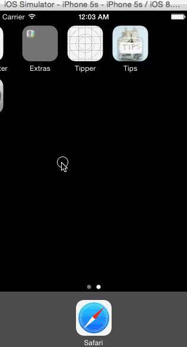

tips demo app 
=========
## Description

Demo apps for iOS in Objective-C and Swift based on the [codepath assignments and tutorials](https://courses.codepath.com/snippets/intro_to_ios/thanks_for_applying)

### Assigment summary

* Hours to complete 7h (2h learning Objective-C/Swift basics, 2h Tips controller, 2h for optional story (setting controller), fix bugs and cosmetics (1h)
* Completed stories:
   * Tips controller  (followed video walkthrough)
   * Settings controller: use vertical sliders and allow resetting to defaults
* Also completed Swift version under swift/Tipper (Tips controller only)

## Installation/Run

* Run: open Tips.xcodeproj
* Choose Iphone5s simulator
* Click on Command+R
* Start "Tips" app on simulator

## Demo
Here's a demo of the objective-c app:

GIF created with [LiceCap](http://www.cockos.com/licecap/).

## License

Licensed under the **[Apache License, Version 2.0] [license]** (the "License");
you may not use this software except in compliance with the License.

